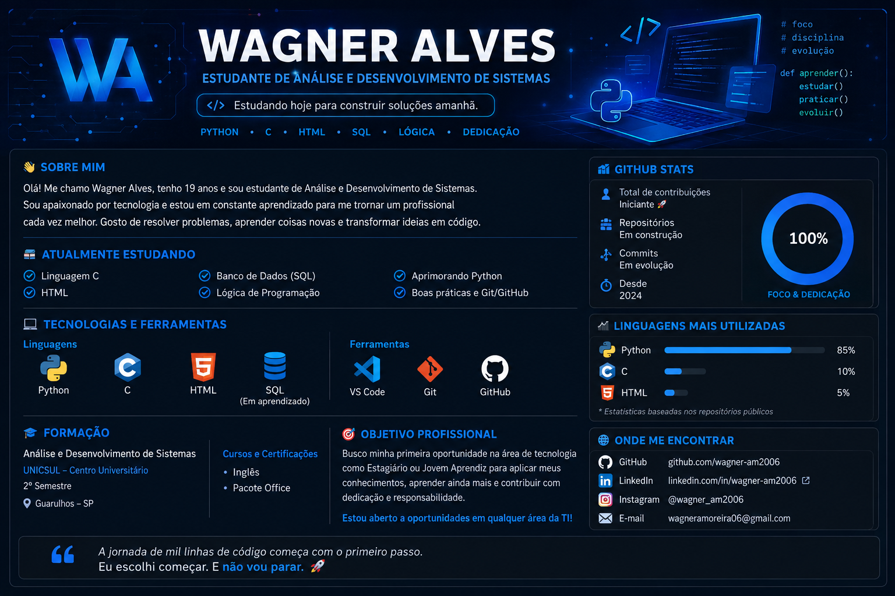

<div align="center">



# 👋 Olá, eu sou o Wagner Alves!

### 🎓 Estudante de Análise e Desenvolvimento de Sistemas | 💻 Em formação na área de Tecnologia

<p>
  <a href="https://github.com/wagner-am2006">
    
  </a>
  <a href="https://www.linkedin.com/in/wagner-am2006">
    
  </a>
  <a href="mailto:wagneramoreira06@gmail.com">
    
  </a>
</p>

</div>

---

## 👨‍💻 Sobre mim

Olá! Meu nome é **Wagner Alves** e sou estudante de **Análise e Desenvolvimento de Sistemas** na **Universidade Cruzeiro do Sul (UNICSUL)**.

Atualmente estou no **2º semestre** e construindo minha base na área de tecnologia por meio de estudos, atividades acadêmicas e projetos práticos.

Minha principal linguagem atualmente é **Python**, e também estou aprendendo **C, HTML e SQL**, buscando desenvolver cada vez mais minha lógica de programação e meus conhecimentos em desenvolvimento de sistemas.

Estou no início da minha jornada profissional e tenho como objetivo conquistar minha **primeira oportunidade na área de tecnologia**, seja como **estagiário ou jovem aprendiz**, onde eu possa aprender, colocar meus conhecimentos em prática e evoluir profissionalmente.

> 🚀 **Ainda estou no começo, mas estou construindo minha jornada linha por linha.**

---

## 📚 Atualmente estudando

- 🐍 **Python** — minha principal linguagem
- ⚙️ **Linguagem C**
- 🌐 **HTML**
- 🗄️ **Banco de Dados / SQL**
- 🧠 **Lógica de Programação**
- 🔧 **Git e GitHub**
- 💻 **VS Code**

---

## 🛠️ Tecnologias e ferramentas

### Linguagens

<p>
  
  
  
</p>

### Banco de dados

<p>
  
</p>

> 📌 **SQL está atualmente em aprendizado acadêmico.**

### Ferramentas

<p>
  
  
  
</p>

---

## 🎓 Formação

**Análise e Desenvolvimento de Sistemas — UNICSUL**  
📍 Universidade Cruzeiro do Sul  
📚 2º semestre

### Cursos complementares

- 🇺🇸 Curso de Inglês
- 📊 Curso de Pacote Office

---

## 🎯 Objetivo profissional

Estou em busca da minha **primeira oportunidade profissional na área de tecnologia**.

Tenho interesse em oportunidades como:

- 💼 Estágio em Tecnologia
- 🌱 Jovem Aprendiz
- 💻 Desenvolvimento de Software
- 🗄️ Banco de Dados
- 🛠️ Suporte e áreas relacionadas à Tecnologia da Informação

Meu principal objetivo é encontrar um ambiente onde eu possa **aprender com profissionais experientes, aplicar meus conhecimentos, desenvolver novas habilidades e contribuir com a equipe**.

> **Estou aberto a oportunidades que possam me ajudar a crescer e construir minha carreira na área de tecnologia.**

---

## 📊 GitHub Stats

<div align="center">


</div>

---

## 📈 Minha jornada

```text
🎓 ADS
   │
   ├── 🐍 Python
   ├── ⚙️ C
   ├── 🌐 HTML
   ├── 🗄️ SQL
   ├── 🧠 Lógica de Programação
   └── 🔧 Git & GitHub
          │
          ▼
    🚀 Primeira oportunidade
          │
          ▼
    💻 Desenvolvedor
```

---

## 📂 Projetos

Atualmente estou começando a utilizar o GitHub para armazenar e organizar meus projetos e atividades acadêmicas.

Em breve, esta seção será atualizada com meus principais projetos pessoais e acadêmicos.

### 🔨 Em construção...

> Este perfil está em constante evolução, assim como meus conhecimentos em tecnologia.

---

## 🌎 Onde me encontrar

<div align="center">

| Plataforma | Link |
|---|---|
| 🐙 **GitHub** | [wagner-am2006](https://github.com/wagner-am2006) |
| 💼 **LinkedIn** | [Wagner Alves](https://www.linkedin.com/in/wagner-am2006) |
| 📸 **Instagram** | [@wagner_am2006](https://www.instagram.com/wagner_am2006) |
| 📧 **E-mail** | [wagneramoreira06@gmail.com](mailto:wagneramoreira06@gmail.com) |

</div>

---

<div align="center">

### 💙 Obrigado por visitar meu perfil!

**"A jornada de mil linhas de código começa com o primeiro passo."**

🚀 *Estudando hoje para construir soluções amanhã.*

</div>
